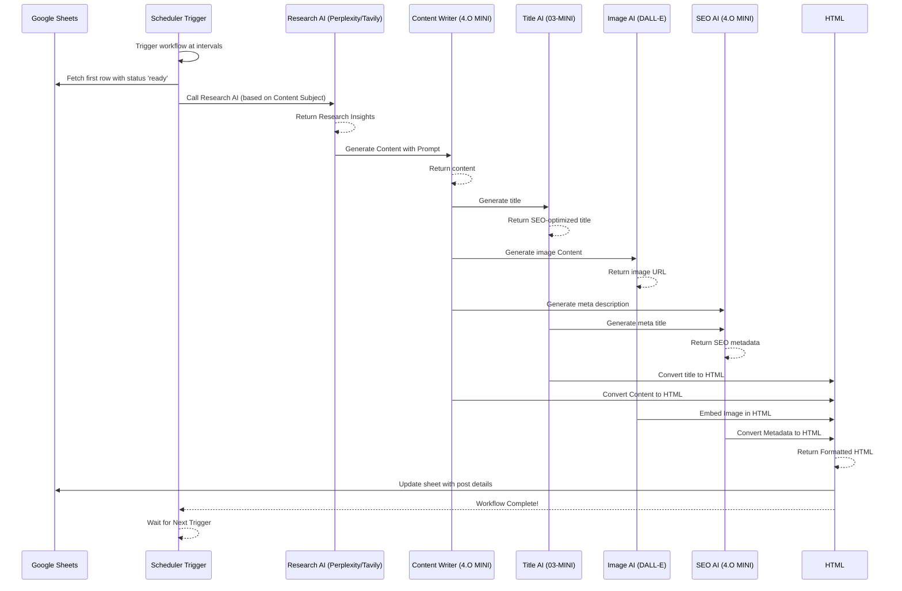

## Workflow Content Marketing

```mermaid
sequenceDiagram
    participant GoogleSheets as Google Sheets
    participant Scheduler as Scheduler Trigger
    participant AIResearch as Research AI (Perplexity/Tavily)
    participant AIContent as Content Writer (4.O MINI)
    participant AITitle as Title AI (03-MINI)
    participant AIImage as Image AI (DALL-E)
    participant SEO as SEO AI (4.O MINI)
    participant HTML as HTML

    Scheduler->>Scheduler: Trigger workflow at intervals
    Scheduler->>GoogleSheets: Fetch first row with status 'ready'
    
    Scheduler->>AIResearch: Call Research AI (based on Content Subject)
    AIResearch-->>AIResearch: Return Research Insights

    AIResearch->>AIContent: Generate Content with Prompt
    AIContent-->>AIContent: Return content
    
    AIContent->>AITitle: Generate title
    AITitle-->>AITitle: Return SEO-optimized title
    
    AIContent->>AIImage: Generate image Content
    AIImage-->>AIImage: Return image URL
    
    AIContent->>SEO: Generate meta description
    AITitle->>SEO: Generate meta title
    SEO-->>SEO: Return SEO metadata

    AITitle->>HTML: Convert title to HTML
    AIContent->>HTML: Convert Content to HTML
    AIImage->>HTML: Embed Image in HTML
    SEO->>HTML: Convert Metadata to HTML
    HTML-->>HTML: Return Formatted HTML
    
    HTML->>GoogleSheets: Update sheet with post details    
    HTML-->>Scheduler: Workflow Complete!
    Scheduler-->>Scheduler: Wait for Next Trigger


```
