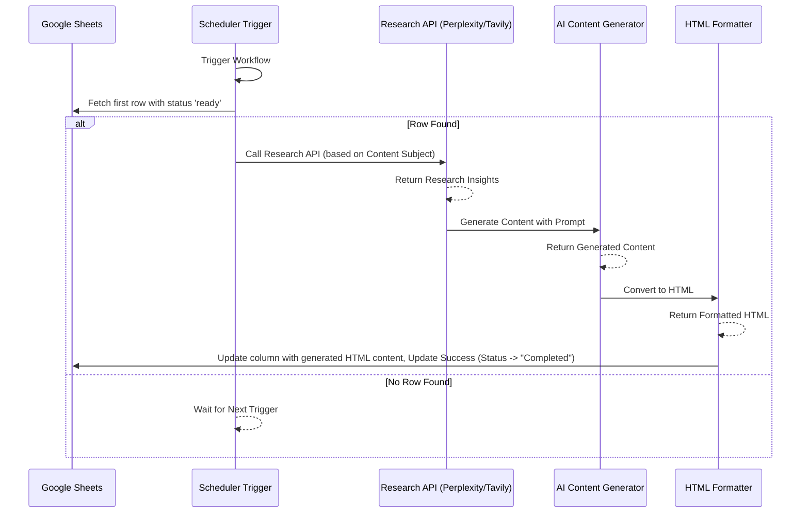

## Workflow Content Marketing

```mermaid
sequenceDiagram
    participant GoogleSheets as Google Sheets
    participant Scheduler as Scheduler Trigger
    participant API as Research API (Perplexity/Tavily)
    participant AI as AI Content Generator
    participant HTML as HTML Formatter

    Scheduler->>Scheduler: Trigger Workflow
    Scheduler->>GoogleSheets: Fetch first row with status 'ready'
    
    alt Row Found
        Scheduler->>API: Call Research API (based on Content Subject)
        API-->>API: Return Research Insights
        
        API->>AI: Generate Content with Prompt
        AI-->>AI: Return Generated Content
        
        AI->>HTML: Convert to HTML
        HTML-->>HTML: Return Formatted HTML
        
        HTML->>GoogleSheets: Update column with generated HTML content, Update Success (Status -> "Completed")
    else No Row Found
        Scheduler-->>Scheduler: Wait for Next Trigger
    end

```
